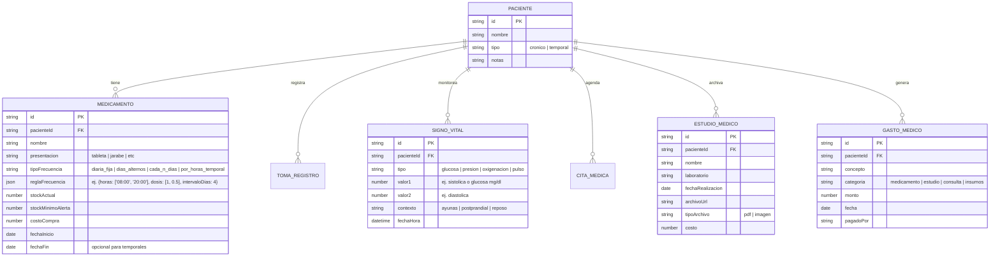

# Documento de Especificación y Arquitectura: SaludFamiliar PWA

## 1. Visión General del Producto
**SaludFamiliar / CuidadorApp** es una Aplicación Web Progresiva (PWA) instalable en computadoras y dispositivos móviles (Android/iOS) diseñada para centralizar el cuidado médico de la familia. Permite gestionar tratamientos crónicos complejos en adultos mayores, tratamientos temporales agudos (infecciones, etc.), registrar signos vitales (glucosa, presión, oxigenación), archivar estudios clínicos digitales con adjuntos (PDF/imágenes), agendar citas con especialistas y dividir los gastos médicos familiares de forma transparente.

---

## 2. Personas y Casos de Uso
1. **Cuidador Principal (en PC de trabajo y celular):**
   - Recibe notificaciones de tomas del día directamente en el navegador.
   - Marca tomas en el checklist diario.
   - En caso de ausentarse, genera con 1 clic la lista de pendientes para enviarla por WhatsApp al cuidador suplente.
   - Registra tomas de signos vitales (ej. serie de 3 días de glucosa o presión solicitada por el doctor).
   - Sube comprobantes de estudios y compras.
2. **Adulto Mayor / Paciente Crónico:**
   - Cuenta con un perfil dedicado con reglas de medicación complejas (fracciones de pastillas, días alternos, cada $N$ días).
3. **Familiar con Tratamiento Temporal (ej. Esposa con infección):**
   - Perfil con tratamiento por tiempo limitado (ej. cada 8 horas durante 7 días), con cuenta regresiva del tratamiento.
4. **Núcleo Familiar:**
   - Visualiza el total de gastos médicos del mes y el cálculo de la división de costos entre los integrantes designados.

---

## 3. Arquitectura Técnica

### Frontend & PWA
- **Framework:** React + Vite (rápido, modular y optimizado).
- **Estilos:** Diseño responsivo *Mobile-First* y *Desktop Dashboard*, enfocado en accesibilidad (alta legibilidad, botones táctiles amplios, estados claros).
- **PWA:** Service Worker + Web App Manifest (`manifest.json`) para instalación directa en pantalla de inicio de Android/iOS y como app de escritorio en Windows/Mac.
- **Notificaciones:** Web Notifications API para alertas nativas en escritorio/móvil al llegar la hora de una toma.
- **Exportación WhatsApp:** Generador de texto codificado `encodeURIComponent` listo para abrir la API de WhatsApp con formato enriquecido (emojis, horarios, dosis y notas).

### Backend & Almacenamiento (Capa Gratuita)
- **Base de Datos:** Firebase Firestore (sincronización en tiempo real multidispositivo, consultas ágiles y plan gratuito amplio).
- **Autenticación:** Firebase Auth (Email/Contraseña o Google One-Tap).
- **Almacenamiento de Archivos:** Firebase Storage (subida segura de PDFs de laboratorios, recetas y fotos de estudios).
- **Modo Offline:** Persistencia local de Firestore y LocalStorage para funcionamiento sin interrupciones ante fallas de conexión.

---

## 4. Modelo de Datos Principal



---

## 5. Módulos y Funcionalidades Clave

### A. Motor de Frecuencias de Medicamentos
- **Pauta 1 (Metformina/Sitagliptina):** Diaria con dosis variables (1 tableta a las 8:00 AM, 0.5 tableta a las 8:00 PM).
- **Pauta 2 (Aspirina):** Cada $N$ días (cada 4 días a una hora fija).
- **Pauta 3 (Cilostazol):** Diaria fija.
- **Pauta 4 (Rivaroxabán):** Días alternos (un día sí, un día no).
- **Pauta 5 (Antibiótico Temporal):** Cada 8 horas durante 5 días con fecha de inicio y término automático.

### B. Módulo de Signos Vitales
- Registro ultra rápido de:
  - **Glucosa** (mg/dL) + Etiqueta (Ayunas / 2h Post-alimentos / Antes de dormir).
  - **Presión Arterial** (Sistólica / Diastólica / Pulso).
  - **Oxigenación & Pulso** (% SpO2 y lpm).
- Modo **"Campañas de Monitoreo"** (ej. "Control de 3 días solicitado por Dr. X") con resumen tabular y gráfico exportable para la consulta.

### C. Módulo Financiero y Repartición de Gastos
- Registro de compras de farmacia, pagos de consultas y estudios.
- Selector de familiares que aportan (ej. Hermano 1, Hermano 2, Familiar 3).
- Resumen mensual con cálculo automático del monto por persona y balance de quién pagó qué.

### D. Delegación Rápida a WhatsApp
Genera automáticamente un mensaje con formato listo para enviar:
```text
📋 MEDICAMENTOS DE HOY - [Nombre Paciente]
📅 Fecha: 17 de Agosto 2026

☀️ MAÑANA (08:00 AM)
[ ] Metformina/Sitagliptina - 1 tableta
[ ] Cilostazol - 1 tableta
[ ] Rivaroxabán - 1 tableta (Toca hoy)

🌙 NOCHE (08:00 PM)
[ ] Metformina/Sitagliptina - 1/2 tableta

⚠️ NOTA: Control de glucosa en ayunas realizado (98 mg/dL).
```
